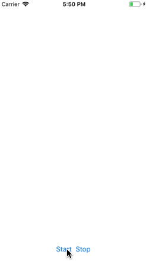
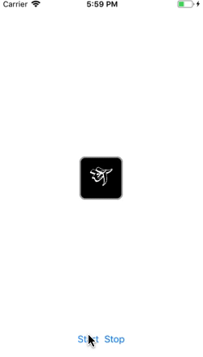
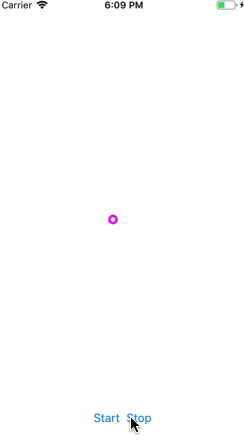
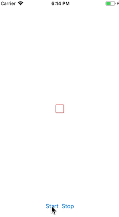
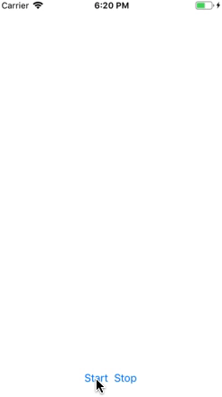

## Introduction

Hi, Humans!

My name is Hamza Farooq and I love 'Swift' programming. I always try to implement new ideas, so here is the glimps of one of my ideas for you.

## HFLoader

HFLoader is a new kind of activity indicator with some awesome animations. Try this new Loader in your projects and enhance the UI experience.

### Round HFLoader With Image


### Rectangular HFLoader With Image


### Round HFLoader Without Image


### Rectangular HFLoader Without Image


### Random Shaped HFLoader Without Image


## Example

To run the example project, clone the repo, and run [loaderUsingAnimations.xcodeproj](https://github.com/hamza-faroooq/HFLoader/tree/master/Example/loaderUsingAnimations/loaderUsingAnimations.xcodeproj) from the 'loaderUsingAnimations' directory.

## Usage

Do the following simple steps to make an awesome [HFLoader](https://github.com/hamza-faroooq/HFLoader)

First of all, download the project, and then place the file named [loaderAnimation.swift](https://github.com/hamza-faroooq/HFLoader/blob/master/Main%20File%20To%20Be%20Used%20In%20Your%20Project/HFLoader.swift) in your project. 

### Initialization


Then, there are two ways you can create HFLoader:

* By storyboard, changing class of any UIView to loaderAnimation.

* By code, using initializer.

```swift
let loaderView = loaderAnimation(frame: CGRect.init(x: 0, y: 0, width: 50, height: 50), viewBGColor: .clear, viewBorderWidth: 2, viewBorderColor: UIColor.orange, viewCornerRadius: 5, viewImage: #imageLiteral(resourceName: "Icon-App-60x60"))
```

Add loaderView as a subView in your controller's main view in your viewDidLoad() as:

```swift
override func viewDidLoad() {
        super.viewDidLoad()
        loaderView.clipsToBounds = True // if the image goes out of view's frame...
        self.view.addSubview(loaderView)
}
```
Note: One thing to keep in mind is that if you use Storyboard approach then the view is not hidden by default, but in programatic approach, the view is hidden by default.

### Control
Write this line whenever you want to start using HFLoader:

```swift
UIApplication.shared.beginIgnoringInteractionEvents() // if you want to stuck the UI or disable user interaction
loaderView.startAnimation()
```

Write this line whenever you want to stop using HFLoader:

```swift
UIApplication.shared.endIgnoringInteractionEvents() // enable user interaction
loaderView.stopAnimation()
```

### Change Properties

You can adjust HFLoader at your own will. If you created HFLoader using storyboard, then you can write the following lines of code to change its appearance

```swift
lv.layer.borderColor = UIColor.black.cgColor
lv.layer.borderWidth = 2.0
lv.layer.cornerRadius = 8.0
```

This will change some properties of HFLoader View as provided. Where lv is the outlet of that view.

And if you are creating HFLoader programatically then you can use it's initializer to change its properties. For Example:

```swift
let lv = loaderAnimation(frame: CGRect.init(x: 0, y: 0, width: 50, height: 50), viewBGColor: .clear, viewBorderWidth: 2, viewBorderColor: UIColor.orange, viewCornerRadius: 5, viewImage: #imageLiteral(resourceName: "Icon-App-60x60"))
```

You can set its frame as you like. Its position will always be centered no matter where you placed your view. 'viewBGColor' is used to change the background color of HFLoader View. And if you want to apply Border to your loader than you can change 'viewBorderWidth' value, and if not, than make it 0. Border Color will show only if Border Width will be provided. To make view a little round or fully round, apply some values to 'viewCornerRadius'. Finally 'viewImage' will be used if you want to add some kind of image or logo inside HFLoader View. Write 'UIImage()' if you don't want to use any image.

That's it... :-)

## Contributions

Your contributions are most welcomed. Do let me know if you find any kind of issue while using this file. Please open an issue to discuss that problem. Thanks

## Auther

Hamza Farooq, hamza_faroooq@yahoo.com

## License

[MIT](https://github.com/hamza-faroooq/HFLoader/blob/master/LICENSE)
